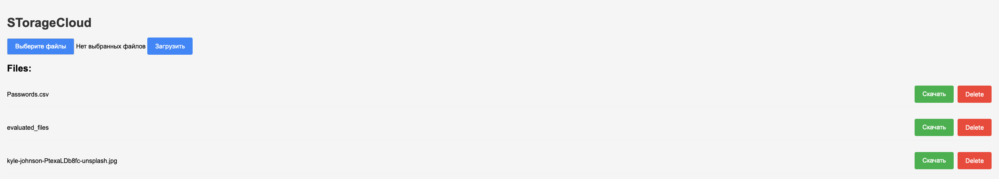
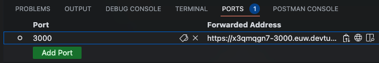

[](https://github.com/stbestichhh/CloudStorage/actions/workflows/node.js.yml)
[](https://choosealicense.com/licenses/mit/)
[](https://github.com/ellerbrock/open-source-badges/)


# STorageCloud

STorageCloud - local cloud storage for your files.

## [CHANGELOG](CHANGELOG.md)

## Screenshots



## Installation

> [!NOTE]
> Visual Studio Code app is needed.

1. Clone repository on your computer.
2. Run commands

```bash
npm i
npm run server
```

3. Provide public port in VSCode



## Authors

- [@stbestichhh](https://www.github.com/stbestichhh)

## Support

For support, email **[stbestich@gmail.com](mailto:stbestich@gmail.com)**
